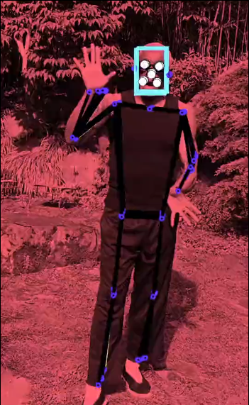

# orml-blazepose

BlazePose is a 2D human pose estimation model that can compute x,y coordinates of 33 skeleton key points, extending the 17 keypoint topology of the original PoseNet model. These additional key points provide vital information about face, hands, and feet location with scale and rotation. Together with face and hand models they can be used to unlock various domain-specific applications like gesture control or sign language without special hardware.

## What can I do with it?

Fast and accurate detection of body and face landmarks in a two-dimensional space in webcam or other video imagery. 

## How to use it?

`orml-blazepose` uses two components `BlazePoseDetector` for detecting regions containing poses and `BlazePoseLandmarks` for detecting landmarks within the pose regions.

Initializing the two detectors is done as follows:

```kotlin
val detector = BlazePoseDetector.load()
val landmarks = BlazePoseLandmarks.upperBody()
```

Then for every frame:

```kotlin
val regions = detector.detect(videoImage)
for (region in regions) {
    computeRoi(region)
    val lms = landmarks.extract(drawer, region,  videoImage)
    for (lm in lms) {
      drawer.fill = ColorRGBa.GREEN
      drawer.circle(lm.imagePosition,10.0 )
    }
}
```
See the provided [simple demo program](src/demo/kotlin/DemoDetector02.kt) for a fully working implementation.

## Example projects

`orml-blazepose` has been used in [I know](https://rndr.studio/projects/i-know) to find poses in video.

[](https://vimeo.com/435730586 "I know")

## Credits and references
Based on:
 * [BlazePose: On-device real-time body pose tracking](https://arxiv.org/abs/2006.10204) (arXiv)
 * [Mediapipe](https://google.github.io/mediapipe/solutions/pose.html)
