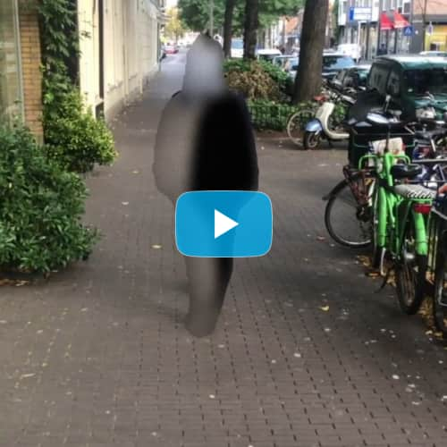

# orml-bodypix

Bodypix is a machine learning model which allows for person and body-part segmentation with TensorFlow. In computer vision, image segmentation refers to the technique of grouping pixels in an image into semantic areas typically to locate objects and boundaries. The BodyPix model is trained to do this for a person and twenty-four body parts (parts such as the left hand, front right lower leg, or back torso). In other words, BodyPix can classify the pixels of an image into two categories: pixels that represent a person and pixels that represent background. It can further classify pixels representing a person into any one of twenty-four body parts.

## What can I do with it?

Bodypix is great for extracting masks for human bodies detected in images. Using these masks one can extract the pixels that belong to the body or the background.

When using Bodypix with hardware accelleration one can perform this in real-time.

## How to use it?

First load a Bodypix model. orml-bodypix comes loaded with two different architectural flavors; `MOBILENET` and `RESNET`. The former
is faster, the latter has a higher accuracy.

```kotlin
// load the bodypix model using MOBILENET architecture
val bodyPix = BodyPix.load(architecture = BodyPixArchitecture.MOBILENET)
```

Then create a color buffer and a tensor to which we will copy our input image.
```kotlin
val inputFlipped = colorBuffer(1920, 1080, type = ColorType.FLOAT32, format = ColorFormat.RGB)
val inputTensor = TFloat32.tensorOf(Shape.of(1, 1920, 1080, 3))
```

Also create an image that will hold the resulting mask.
```kotlin
val segmentationImage = colorBuffer(120, 68, type = ColorType.FLOAT32, format = ColorFormat.R)
```

For every frame copy the flipped input to the input tensor.
```kotlin
inputFlipped.copyTo(inputTensor)
val result = bodyPix.infer(inputTensor)
```


Check [BodyPixImage01.kt](src/demo/kotlin/BodyPixImage01.kt) for a full example of using Bodypix on video input.

## Example work

[](https://vimeo.com/457786737 "Re:Place")

Bodypix has been used in the Re:place installation.


## Credits and references