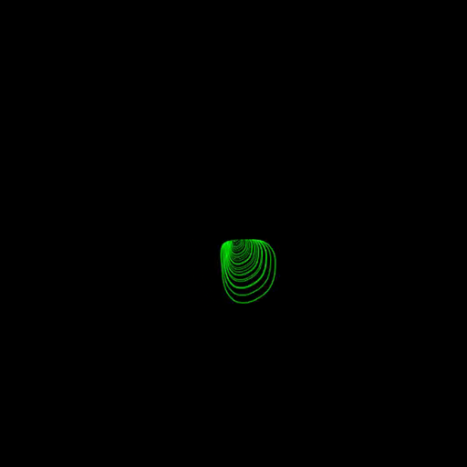
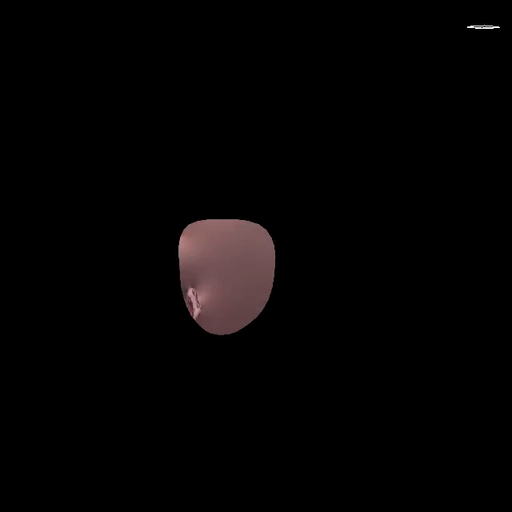
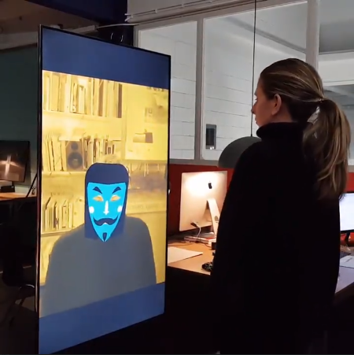

# orml-facemesh

Model and interface for Blazeface and Facemesh. Also includes a port of Mediapipe's 3D pose estimator.

Facemesh is a machine-learning model that allows for facial landmark detection in the browser. It can detect multiple faces at once and provides 486 3D facial landmarks that describe the geometry of each face. Facemesh works best when the faces in view take up a large percentage of the image or video frame and it may struggle with small/distant faces.

## What can I do with it?

Head tracking, face replacement, etc.

## How do I use it?

### Examples
* See [BlaceFace01.kt](src/demo/kotlin/BlazeFace01.kt) for an example of using just BlazeFace.
* See [FaceMesh01.kt](src/demo/kotlin/FaceMesh01.kt) for an example of 3d pose estimation. 
* See [FaceTracker01.kt](src/demo/kotlin/FaceTracker01.kt)
* See [FaceTracker02.kt](src/demo/kotlin/FaceTracker01.kt)

### Example work

[RNDR](https://rndr.studio) made a `orml-facemesh` based mask installation. In this installation CPU inference is used.

## Credits and references
