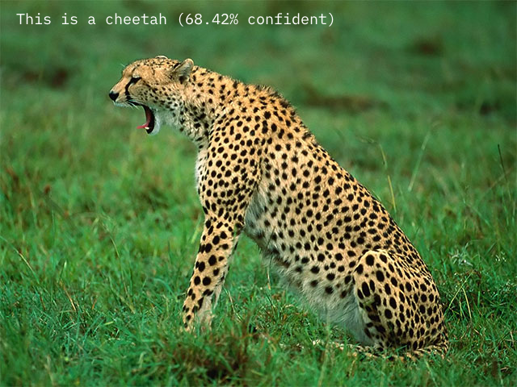
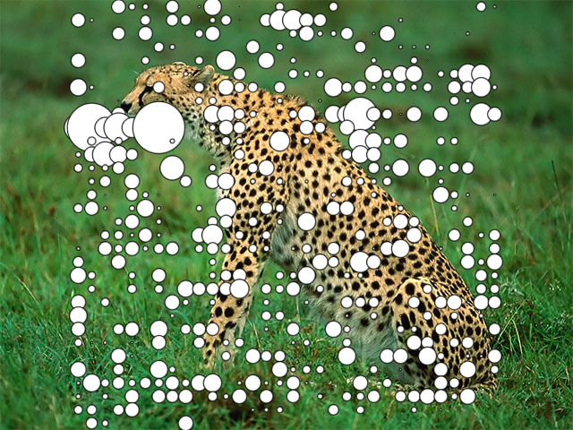

# orml-image-classifier

`orml-image-classifier` provides image classification and embedding based on [ImageNet](https://www.image-net.org/) labelings.

## What can I do with it?

`orml-image-classifier` performs two tasks: _image classification_ and _image embedding_. Image classification finds
which (predefined) classes best match an input image.

Image embedding finds a high dimensional vector (1001 dimensions) that can be seen as a fingerprint for the image. The idea is that 
similar images result in similar fingerprints.

## How do I use it?

### Using the classifier
First load the classifier model.
```kotlin 
val classifier = ImageClassifier.load()
```

To classify an image we ask the `classifier` for classification scores for all classes.
```kotlin
val scores = classifier.classify(image)
```

Here `scores` is a `FloatArray` for which the i-th element describes the score for the i-th label in `imagenetLabels`. 
```kotlin
val scoredLabels = (scores zip imagenetLabels)
```

### Using the embeddings

To get the image embedding:
```kotlin
val embedding = classifier.embed(image)
```

## Examples

In [DemoClassifier.kt](src/demo/kotlin/DemoClassifier.kt) we show the complete process for classifying an image.



In [DemoEmbedding.kt](src/demo/kotlin/DemoEmbedding.kt) we demonstrate how to find an image embedding and show a simple way to visualize the embedding
as a grid of circles.



## Credits and references

Based on 
 * Pretrained MobileNetv3
 * Simple Imagenet labels from [@anishathalye](https://github.com/anishathalye/imagenet-simple-labels/blob/master/imagenet-simple-labels.json) (GitHub)