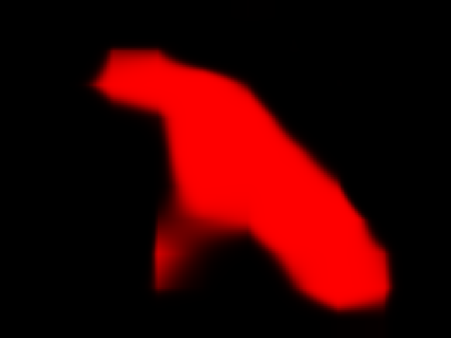

# orml-u2net

A U^2-net that extracts salient parts from input images. 

## What can I do with it?

Extract salient parts from an image.

To understand that a bit better consider this image:


U^2-net finds the most salient parts of the input image and produces a matte image.



The matte image can be used to create a cut-out of the foreground objects. 


## How do I use it?

To load a U2Net instance
```kotlin
val u2net = U2Net.load()
```

After loading the net there are 3 ways to use it:

To remove the background from an image:
```kotlin
val foreground = u2net.removeBackground(inputImage)
```

To remove the foreground from an image (exactly the inverse of removing the background)
```kotlin
val background = u2net.removeForeground(inputImage)
```

To get a matte image for the image
```kotlin
val matte = u2net.matte()
```
## Example projects

* [Collager project by @voorbeeld](https://twitter.com/voorbeeld/status/1323001554580971520) (Twitter) uses `orml-u2net` and `orml-style-transfer` to create
collage-like images.

## Credits and references

Based on:
 * [U^2-net](https://github.com/xuebinqin/U-2-Net) (Github)
 * [U^2-net model conversion by PINTO0309](https://github.com/PINTO0309/PINTO_model_zoo/tree/main/061_U-2-Net) (Github)